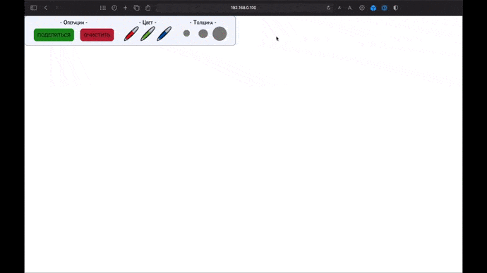

<h1 align="center">Online Whiteboard - Realtime Drawing</h1>

<!-- <p align="center">


</p> -->

<!-- <h2 align="center"><a  href="https://solitairevue.firebaseapp.com">Live Demo</a></h2> -->

## Description

<p align="center">
  
</p>
Online whiteboard app that makes drawing, collaboration and sharing easy.

## How to use

### [DESKTOP, MOBILE]:

- Click (tap) and **move** mouse for drawing picture
- Choose brush color and width on toolbar block
- Click **Clear** button to delete all pictures from board
- Click **Share** button to generate link that you can share to friends and draw pictures together

## About the project.

### Frontend

- It built with `React.js`, `Next.js(SSR, routes)` and `Redux(client storage)`
- Draw is implemented with default HTML5 tag - `<canvas>`
- All your pictures are stored as arrays of points. This approach uses less memory than built-in canvas functions

### Backend -> REST API server

- It built with `Python 3.7`, micro-framework `Flask` and `PostgreSQL` as data storage
- API has scalable structure where each folder is responsible for it's own part of the application logic
- I used `PostgreSQL` as Database because it allow to store JSON-data
- Made unit-tests with python library `pytest`. They are stored here: `/backend/api/tests`

### Backend -> Websockets server

- It built with `Python 3.7` and `websockets` library
- It has rooms that divide connected clients by `board_url` into groups
- It has validation for receiving messages that reject messages with invalid structure

### DevOps

- I used `Docker` to build a microservice application
- List of microservices you can see in file `docker-compose.yml`

## Project setup

Run project:

```
docker-compose up --build
```

Run REST API tests (if container is up):

```
docker-compose exec api pytest
```

Run REST API tests (if container is down):

```
cd backend/api
pytest
```
